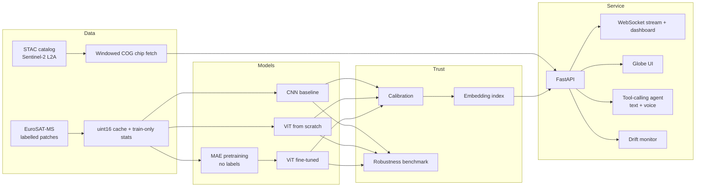

<p align="center">
  
</p>

<h3 align="center">Satellite intelligence you can question.</h3>

<p align="center">
  An Earth-observation ML platform that finds real Sentinel-2 imagery, classifies what it shows,<br>
  explains the answer, and tells you when not to trust it.
</p>

<p align="center">
  
  
  
  
  
</p>

---

**TerraForge classifies Sentinel-2 land cover and then measures whether its own answer can be trusted.**
Every prediction can ship with a calibrated confidence, a prediction *set* with a coverage guarantee, a
flag for inputs outside the calibrated region, and the caveats that apply (processing level, simulated
input, untrained model). The research side is held to the same standard: the one candidate method in
this repository has its success criteria **written down before any real-data run**, and a script
computes the verdict from the results, so nobody, including the author, gets to argue it afterwards.

- **Honest by construction.** Negative and neutral results are reported as results. The simulation already says the candidate method *ties* with a one-line baseline, and this README says so.
- **Trust is the product, not an add-on.** Conformal sets, selective prediction, a robustness benchmark, drift monitoring and a leakage audit are first-class, tested code, not a notebook.
- **Runs on a laptop.** `pip install`, one command, and the service, 3D globe, dashboard and agent are up on CPU with no keys, no GPU and no dataset.

> **Status, stated up front.** The pipeline, trust layer, API and tests are built and verified (138 tests
> pass). **Trained-model results do not exist yet**: the GPU run is pending, so the results table below
> is empty on purpose and the SACP verdict on real models is *not evaluated*. What you can inspect today
> is the simulation evidence, the code, and the pre-registered protocol.

[Worked example](#worked-example) | [Pre-registered evaluation](#headline-pre-registered-honest-evaluation) | [Architecture](#architecture) | [Quick start](#quick-start) | [Reference](#reference) | [Measured results](#measured-results) | [Robustness and security](#robustness-and-security) | [Layout](#repository-layout) | [Design decisions](#design-decisions) | [Stack](#stack) | [Research write-up](#research-write-up) | [Limits](#honest-limits)

## Worked example

Start the service (CPU, no keys) and ask it things. These are real responses from a local run of
`python scripts/serve.py`; the model is the **untrained demo**, and the service says so in every reply.

```bash
curl -s localhost:8000/health
# {"status":"ok","model_version":"cnn-untrained-demo","untrained":true,"source":"synthetic","index_size":512,"explainer":"template"}
```

A random 13-band 64x64 patch posted to `/predict` comes back with `"untrained": true`, a near-uniform
distribution (top probability 0.107 over 10 classes, as expected from an untrained network) and
`"prediction_set": null` because no conformal quantile is loaded. Bad input is refused, not guessed at,
and the agent says plainly when it has fallen back to rules:

```text
POST /predict  {"shape":[1,3,64,64], "data_b64":"AAAA"}   ->  422 {"detail":"data_b64 does not match shape"}
POST /agent    {"message":"is it daytime at 48.85,2.35"}   ->  {"source":"fallback","fallback_reason":"no_llm", ...}
```

Open `http://127.0.0.1:8000/globe` for the 3D globe (real day/night terminator, Sun position and Moon
phase from astronomy formulas) and `/` for the engineer dashboard. Clicking a point on the globe calls
`/analyze`, which fetches a real Sentinel-2 chip over STAC (needs internet), classifies it, and lists
"things to keep in mind".

## Headline: pre-registered, honest evaluation

Most "new method" repos report the one benchmark where the new idea wins. This one is built to do the opposite.

**The question.** Conformal prediction promises "the true class is in the set 90% of the time", but only
if test data looks like the calibration data. Satellite data does not stay that way: haze, a failed band,
cloud and processing level all change the inputs. In a controlled simulation the plain guarantee collapses
from **0.941 coverage on clean data to 0.441** at high severity, and at severity 0.6 it *cannot* reach
90% at any set size ([table below](#measured-results)).

**The candidate.** **SACP** (severity-aware conformal prediction) learns a "how corrupted is this input"
score from simulated physical corruptions and calibrates the conformal threshold per severity bin.
Binning by an uncertainty score is *not* new and the repo does not claim it is. The open question is
whether a covariate learned from physical severity beats simply binning by softmax entropy or by
embedding novelty.

**The pre-registration** ([docs/algorithm.md](docs/algorithm.md), written before any real-data run):
calibrate on clean data plus all corruption families except one, test on the held-out family, repeat for
every family. SACP is declared **supported** only if, against `cond_novelty` and `cond_entropy`:

| # | Criterion | Why it is there |
|---|---|---|
| 1 | Worst under-coverage is no larger | A valid method must not fail worse in the worst case |
| 2 | Mean set size at most 10% larger | Coverage bought with huge sets is not a win |
| 3 | Smaller set at matched 90% coverage, paired-bootstrap 95% CI excludes zero | Compares ranking quality, not caution, and guards against noise |
| 4 | `raps`, `weighted`, `pooled_aug` do not match its coverage at equal size | The simple baselines must not already do the job |

**The verdict is mechanical.** [`training/preregistered.py`](src/terraforge/training/preregistered.py) encodes
these rules and [`scripts/sacp_verdict.py`](scripts/sacp_verdict.py) applies them to the JSON written by
`scripts/analyze.py`. Four unit tests cover the supported, tie, spoiler and oversized-set cases. Where the
pre-registration left a detail open (for example "the best of" two baselines), the code takes the strict
reading and prints that choice next to the verdict.

**What the simulation already says, before any real data:** SACP is *not* separated from entropy- or
novelty-conditioning (set size at 90% coverage, severity 0.6: SACP 2.68, entropy 2.65, novelty 2.78,
within noise), and a plain pooled-augmentation baseline reaches 2.64. The docs call a null result "the
expected outcome". Several hybrids (`sacp_cqr`, `sacp_raps`, weighted conformal) are kept in the benchmark
as **negative results**. If the real-data run ends the same way, that is what will be published.

```bash
python scripts/sacp_verdict.py runs/analysis_vit_mae_s0.json   # after scripts/analyze.py on trained weights
```

## Architecture



Design rules that shape the code:

1. **No leakage.** Statistics come from the train split only; the best epoch is chosen on validation; the test set is evaluated once.
2. **Geography travels with the data.** CRS and transform stay attached to every array; areas are computed in metres, never square degrees.
3. **Fail loudly, degrade gracefully.** Bad input raises a clear error; an unavailable dependency triggers a labelled fallback.
4. **Honest labelling.** Untrained model, synthetic input, processing-level mismatch: each is shown to the user, not buried in a footnote.
5. **Cost-aware.** Heavy training runs on a free cloud GPU; CI runs on pull requests or manually.

## Quick start

Verified on Windows with Python 3.11 and CPU-only PyTorch (the geospatial wheels were not available for
3.14 during development; see [docs/HANDOFF.md](docs/HANDOFF.md)).

```bash
pip install -e ".[serve,dev]"          # service + test dependencies
python scripts/serve.py                # untrained demo model + synthetic stream on :8000
pytest -q                              # 138 passed in 86 s on CPU
python scripts/simulate_shift.py       # regenerates the conformal-under-shift tables in ~20 s, no data needed
```

Open `http://127.0.0.1:8000/globe` (globe + agent) and `/` (engineer dashboard).

Training and trust analysis need the EuroSAT download and, realistically, a GPU (or the Kaggle launcher below):

```bash
pip install -e ".[train]"
python scripts/build_dataset.py        # downloads EuroSAT-MS, builds uint16 cache + train-only statistics
python scripts/pretrain_mae.py         # optional self-supervised pretraining -> runs/mae_encoder.pt
python scripts/train.py --model vit --pretrained runs/mae_encoder.pt --tag vit_mae_s0
python scripts/analyze.py --arch vit --weights runs/vit_mae_s0.pt --out runs/analysis_vit_mae_s0.json
python scripts/sacp_verdict.py runs/analysis_vit_mae_s0.json
python scripts/serve.py --arch vit --weights runs/vit_mae_s0.pt \
       --conformal runs/analysis_vit_mae_s0_conformal.json --root <EuroSAT root>
```

These training commands were not executed end to end here (they need the download and a GPU); they
match the argument parsers in `scripts/`. Optional LLM features read `GROQ_API_KEY` from the environment
(or a `.env` named by `TERRAFORGE_ENV_FILE`, kept outside the repository; only allow-listed keys are
read). Without it the agent and explainer use their rule-based fallbacks. `docker compose up` builds a
CPU image plus MLflow; the image has **not been built or run** (no Docker on the dev machine).

## Reference

**HTTP and WebSocket** (`src/terraforge/api/main.py`)

| Endpoint | Purpose |
|---|---|
| `GET /health` | Model version, `untrained` flag, source kind, index size |
| `POST /predict` | Batch of 13-band patches (base64 float32, up to 256) -> label, calibrated confidence, conformal set |
| `POST /similar`, `/explain`, `/explain_facts` | Embedding retrieval and retrieval-grounded explanation |
| `GET /analyze?lat=&lon=` | Real STAC chip -> classify -> explain, with caveats; 504 with a plain message if imagery is slow |
| `POST /agent` | Tool-calling agent (geocode, daylight, scene search, area, analyse a point); rule-based fallback |
| `GET /sky` | Sun subpoint, terminator, Moon phase |
| `WS /ws/stream` | Live batches with thumbnails and neighbours |
| `GET /`, `/globe` | Dashboard and 3D globe |

**Scripts**

| Script | Does |
|---|---|
| `build_dataset.py` | EuroSAT-MS manifest, stratified 70/15/15 split, uint16 cache, train-only stats |
| `pretrain_mae.py` | Masked-autoencoder pretraining (75% masking) |
| `train.py` | Trainer for `cnn` or `vit`; writes `<tag>.pt` and `<tag>.json` (metrics, calibration, robustness) |
| `analyze.py` | Conformal coverage under shift, held-out-family comparison, selective prediction, leakage audit |
| `sacp_verdict.py` | Applies the pre-registered SACP criteria to an `analyze.py` report |
| `simulate_shift.py` | Reproduces the simulation tables in `docs/algorithm.md` |
| `serve.py`, `export_onnx.py` | Run the service; export to ONNX with a numerical-parity check |

## Measured results

### Evidence that exists today (reproducible on a laptop)

**1. Test suite.** `pytest -q` on Python 3.11, CPU: **138 passed** in 86 s. Hand-written maths is
cross-checked against scikit-learn, SciPy, NumPy and PyTorch in
[`tests/test_reference_math.py`](tests/test_reference_math.py): confusion matrix and macro-F1, error AUROC
with ties, ranks, conformal quantile, kNN novelty, PSI, ECE, temperature scaling, and multi-head
attention against PyTorch's `scaled_dot_product_attention`.

**2. Conformal coverage under controlled shift** (`python scripts/simulate_shift.py`; mean of 5 seeds;
target 0.90; each cell is coverage / mean set size). A simulator with known severity: it tests the
mechanism, **not** satellite data.

| method | s=0.0 | s=0.2 | s=0.4 | s=0.6 | s=0.8 |
|---|---|---|---|---|---|
| plain split conformal (`scp`) | 0.941 / 1.01 | 0.868 / 1.01 | 0.758 / 1.01 | 0.604 / 1.01 | 0.441 / 1.00 |
| pooled augmentation (`pooled_aug`) | 0.984 / 1.25 | 0.951 / 1.37 | 0.884 / 1.52 | 0.773 / 1.64 | 0.623 / 1.71 |
| conditional on novelty | 0.954 / 1.07 | 0.930 / 1.34 | 0.903 / 1.77 | 0.852 / 2.24 | 0.762 / 2.58 |
| conditional on entropy | 0.985 / 1.31 | 0.964 / 1.56 | 0.925 / 1.88 | 0.854 / 2.21 | 0.744 / 2.47 |
| **SACP** | 0.966 / 1.11 | 0.952 / 1.45 | 0.930 / 1.96 | 0.882 / 2.45 | 0.796 / 2.81 |
| RAPS | 0.993 / 1.95 | 0.982 / 2.27 | 0.954 / 2.57 | 0.901 / 2.82 | 0.807 / 2.99 |

Set size needed to actually reach 90% coverage (lower is better; `inf` = never; 4 seeds):

| method | s=0.0 | s=0.3 | s=0.6 |
|---|---|---|---|
| plain split conformal | 1.00 | 1.31 | inf |
| pooled augmentation | 1.00 | 1.33 | 2.64 |
| conditional on novelty | 1.00 | 1.43 | 2.78 |
| conditional on entropy | 1.03 | 1.34 | 2.65 |
| **SACP** | 1.00 | 1.34 | 2.68 |
| hybrid union | 1.03 | 1.31 | 2.61 |
| `sacp_cqr` (negative result) | 1.01 | 1.40 | 3.12 |
| weighted conformal (negative result) | 1.00 | 2.03 | 4.14 |

Reading: the problem is real (coverage 0.941 falls to 0.441). *Any* covariate that indexes the shift fixes
most of it. SACP is **not** better than the simple ones here. Severity 0.8 lies beyond the simulated
calibration range (maximum 0.75), so that column is extrapolation, which the calibrated-envelope p-value
exists to flag. The headline table in [docs/algorithm.md](docs/algorithm.md) has every method and the full
methodology.

**3. Model sizes** (counted from the code): `SmallCNN` 245,354 parameters; `ViT` (6 blocks, dim 128, 4
heads, 8x8 patches, 13 bands) 1,306,250.

### Trained-model results: pending

Protocol (identical for every model): AdamW, warmup + cosine LR, label smoothing, EMA weights, best
epoch picked on validation macro-F1, test evaluated once, three seeds.

| Model | Test accuracy | Macro-F1 | ECE (raw -> calibrated) |
|---|---|---|---|
| CNN baseline | pending GPU run | | |
| ViT (scratch) | pending GPU run | | |
| ViT (MAE-pretrained) | pending GPU run | | |

A private Kaggle GPU kernel (`kaggle/entry.py`) runs the whole suite (MAE pretraining, CNN, scratch ViT,
MAE-initialised ViT, 3 seeds, DDP smoke test). It was started, but its output has not been collected.
Resume steps: [docs/HANDOFF.md](docs/HANDOFF.md). Numbers go in this table only after a run in this
repository produces them.

```bash
python kaggle/launch.py push      # start the kernel from current main
python kaggle/launch.py status    # QUEUED / RUNNING / COMPLETE / ERROR
python kaggle/launch.py pull      # download results into runs_kaggle/
```

## Robustness and security

| Concern | What the code does | Evidence |
|---|---|---|
| Untrained or synthetic output mistaken for real | `untrained` flag on every API response; source kind shown in the UI | Live `/health` and `/predict` responses above; API tests |
| Malformed or oversized input | Shape and size validated; batch capped at 256; 422 with a reason | Live 422 above; `tests/test_api_system.py` |
| Hung imagery service | GDAL timeouts and retries, in-memory chip cache, hard deadline returning HTTP 504 | `data/chip_fetcher.py`, `/analyze`; tests mock upstream |
| LLM or geocoder down | Rule-based fallback labelled `source: fallback` with a reason | Live `/agent` reply above; `tests/test_agent.py` |
| Agent runs away | Step cap, validated tool arguments, contained tool errors | `agent/core.py`; `tests/test_agent.py` |
| Secrets | Loaded from a `.env` outside the repo with an allow-list (`GROQ_API_KEY`, `HF_TOKEN`); the Kaggle launcher imports only username and key and never prints them | `scripts/serve.py`, `kaggle/launch.py` |
| Container | Non-root user, health check, CPU-only, weights mounted rather than baked in | `Dockerfile` (written, **never built**) |
| Tests silently skipped in CI | CI installs torch, scikit-learn and scipy, so `importorskip` no longer drops most of the suite | `.github/workflows/ci.yml` (runs on pull requests or manually; not yet run on GitHub since this change) |

## Repository layout

```
src/terraforge/
  data/        STAC client, windowed chip fetcher, raster processing, EuroSAT cache + dataset
  geo/         GeoPandas AOI layer, sun/moon/terminator astronomy
  models/      CNN, ViT (from scratch), masked autoencoder, attention rollout
  training/    trainer, calibration, conformal, shift_conformal (SACP + baselines),
               preregistered (mechanical verdict), selective, robustness, drift, schedule/EMA, DDP
  inference/   batching engine, vector index
  agent/       tool-calling agent, tools, geocoder
  multimodal/  retrieval-grounded explainer
  api/         FastAPI app, dashboard, globe UI, sources
scripts/       dataset, training, MAE pretraining, trust analysis, SACP verdict, simulation, serving, ONNX export
kaggle/        GPU kernel + launcher
docs/          problem, algorithm (pre-registration), decisions, architecture, dataset, roadmap, handoff
tests/         unit, API, agent, geospatial, model and reference-math tests
```

Placeholders that do nothing yet: `data/dataset_builder.py`, `data/patch_extractor.py`,
`models/foundation.py` (EO foundation-model fine-tune is planned), `scripts/evaluate.py`,
`scripts/download_data.py`, `docs/technical_report.md`, `docs/hpc_training.md`.

## Design decisions

Full log with alternatives: [docs/decisions.md](docs/decisions.md). The ones with evidence:

| Why X | Over Y | Evidence |
|---|---|---|
| Decide the +1000 reflectance offset from pixel statistics (`offset_present`) | Trusting catalog metadata | A real Paris L2A scene declared an offset its data did not have: median blue DN 849, 5th percentile about 200. Subtracting the declared offset clipped roughly half the pixels to zero; without it band means were sensible (NDVI 0.13 for a scene about 69% built-up) |
| Parallel band reads plus timeouts, a cache and a 504 path | Sequential reads | 13 sequential reads took about 75 s; parallelised, the same request took 11 s once and 244 s another time. Latency variance is **not** claimed fixed |
| Exact cosine search in NumPy | FAISS / HNSW | At about 27k vectors a matrix product takes milliseconds; the interface allows a swap |
| ViT and masked autoencoder written from scratch | timm / torchvision | Every component is unit-tested (attention rows sum to 1, tiny-batch overfit, attention vs PyTorch SDPA) |
| uint16 memmap cache | Per-file GeoTIFF reads | The source is uint16, so the cache is lossless and half the size of float32; per-file reads dominated CPU runtime |
| Train-only statistics, best epoch on validation, test once | Convenience | Anything else makes the headline number optimistic |
| Thread pool for CPU inference chunks | Process pool | PyTorch releases the GIL in kernels; threads avoid copying the model |
| Python 3.11 venv | Python 3.14 | The geospatial stack had no 3.14 wheels during development; pip began compiling rasterio from source |

## Stack

| Layer | Tools |
|---|---|
| Data | Earth Search STAC (pystac-client), rasterio, xarray, GeoPandas, EuroSAT-MS |
| Models | PyTorch, hand-written ViT and masked autoencoder |
| Trust | Conformal (LAC, APS, RAPS, Mondrian, SACP), temperature scaling, selective prediction, PSI drift |
| Serving | FastAPI, WebSocket, uvicorn, exact cosine index, optional ONNX |
| UI | globe.gl / three.js, engineer dashboard |
| Agent | Tool-calling loop; Groq-hosted LLM optional, rule-based fallback |
| Ops | Docker (CPU, unbuilt), MLflow, GitHub Actions (PR / manual), Kaggle GPU kernel |

## Research write-up

- **Problem and research questions** (Q1 conformal under shift, Q2 does confidence rank errors last, Q3 spatial leakage, Q4 L1C to L2A gap): [docs/problem.md](docs/problem.md)
- **Method, prior art, proposition and pre-registration**: [docs/algorithm.md](docs/algorithm.md). The prior-art list is explicit about what SACP is *not* (Mondrian, weighted conformal, RAPS, group-conditional conformal), and novelty is not claimed.
- **Proposition (coverage deficit).** For a test point in bin `b`, `Q_b(S <= q_b) >= 1 - alpha - TV(P_b, Q_b)`: coverage is restored exactly to the extent that the covariate is sufficient for the shift's effect on scores. Checked numerically in `tests/test_shift_conformal.py`.
- **Evaluation standards** beyond nominal coverage: matched-coverage efficiency, a conformal p-value "calibrated envelope" that says where the guarantee is not claimed, effective severity on a common axis, paired-bootstrap CIs, minimum bin size.
- **Decision log, handoff and roadmap**: [docs/decisions.md](docs/decisions.md), [docs/HANDOFF.md](docs/HANDOFF.md), [docs/ROADMAP.md](docs/ROADMAP.md).

## Honest limits

- **No trained-model numbers yet.** Accuracy, calibration and the SACP verdict on real models all wait on the GPU run.
- **Simulation is not satellite data.** In it, novelty and entropy track severity almost perfectly, which flatters the simple baselines.
- **Land cover, not crop stress.** EuroSAT labels land use. Vegetation-stress work is on the [roadmap](docs/ROADMAP.md) and will use clearly labelled proxy signals.
- **Processing-level gap.** Training data is Level-1C; live imagery is Level-2A and has no B10 band. Click-to-analyse reports this on every result; the gap is not yet measured.
- **Patch-level splits.** EuroSAT patches come from larger scenes, so a random split can flatter scores. The leakage audit in `analyze.py` measures this and has not yet been run on a trained model.
- **Browser rendering unverified.** The globe and dashboard pages are served (HTTP 200); how they render in a real browser has not been checked.
- **Free-tier services.** The LLM, geocoder and imagery depend on third-party endpoints with rate limits and variable latency.
- **Docker image never built.** Treat the container as untested.

## Acknowledgements

Sentinel-2 data: Copernicus programme / ESA. Catalog access: Earth Search by Element 84.
Dataset: EuroSAT (Helber et al., 2019). Geocoding: OpenStreetMap Nominatim. Globe: globe.gl and three.js.

## License

MIT, see [LICENSE](LICENSE).
