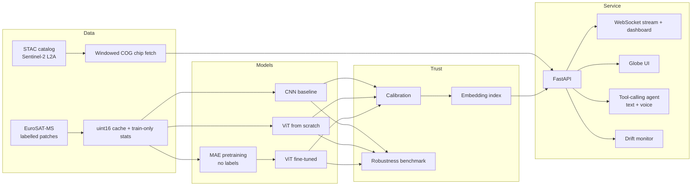

<p align="center">
  
</p>

<h3 align="center">Satellite intelligence you can question.</h3>

<p align="center">
  An Earth-observation ML platform that finds real Sentinel-2 imagery, classifies what it shows,<br>
  explains the answer, and tells you when not to trust it.
</p>

---

## Why this exists

Satellite imagery is free and abundant. Using it is not. Most people who need answers from it
(an agronomist checking a field, an NGO tracking land use, a student, a developer prototyping)
face the same wall: finding the right scene, handling bands and projections, running a model, and
then deciding whether the output can be believed.

Most demos skip the last part. They show a confident label and nothing about cloud cover,
sensor differences, or what the model has never seen. TerraForge is built around the opposite
idea: **an answer is only useful if it comes with its limits**. Every result carries its
caveats, confidence is calibrated rather than raw, and anything untrained or simulated is
labelled as such on screen.

## Who it is for

| If you are... | TerraForge gives you |
|---|---|
| An analyst or field team | Click a place on a globe, or just ask in plain language, and get a land-cover read with the reasons and the warnings |
| An ML or data engineer | A complete, tested reference pipeline: STAC discovery, windowed COG reads, leakage-aware splits, CNN vs ViT vs self-supervised pretraining, calibration, robustness testing, drift monitoring, serving |
| A team evaluating EO models | A fixed evaluation protocol and a robustness benchmark (band failure, haze, cloud) so models are compared on more than clean-test accuracy |
| A learner | Every component is small, readable and unit-tested; the ViT and masked autoencoder are written from scratch, and `docs/decisions.md` records why each choice was made |

## The technical problem

Classifying clean benchmark patches is close to solved. **Knowing when a classifier is wrong in
deployment is not.** Earth-observation inputs shift in structured ways (processing level L1C vs L2A,
haze, band faults, geography, season), softmax confidence stays high on inputs unlike anything
trained on, a human cannot review millions of scenes, and a language model can describe an image
fluently without being able to measure it. TerraForge treats *trust* as the core problem and
answers it quantitatively:

| Question | Method | Where |
|---|---|---|
| Do prediction sets keep their coverage guarantee under real EO shift? | Split-conformal prediction (LAC, APS, class-conditional/Mondrian), coverage measured under haze, band dropout, cloud, noise | `training/conformal.py`, `scripts/analyze.py` |
| Does the model rank its own errors last? | Selective prediction: risk-coverage, AURC, coverage at fixed accuracy, error AUROC; softmax vs k-NN embedding novelty | `training/selective.py` |
| How much accuracy is spatial leakage? | Embedding near-duplicate audit between test and train patches | `scripts/analyze.py` |
| What does the L1C to L2A gap cost? | Real STAC chips with offset harmonisation, B10 filled and flagged | `data/chip_fetcher.py` |
| Can labels be avoided? | Masked-autoencoder pretraining on unlabeled 13-band patches (75% masking) | `models/mae.py` |

Full problem statement, protocols and what is *not* claimed: [docs/problem.md](docs/problem.md).
Every hand-written numerical routine is cross-checked against scikit-learn, SciPy, NumPy or PyTorch
in [tests/test_reference_math.py](tests/test_reference_math.py).

## What you can do with it

**Ask and explore**
- A 3D globe with the real day/night boundary, Sun position and Moon phase, computed from astronomy formulas and not faked.
- Click any point: the service fetches a real Sentinel-2 chip, classifies it, and explains the result in plain language with "things to keep in mind" one tap away.
- A conversational agent (typed or spoken) that can look up a place, check daylight, search scenes, measure areas and analyse a point. It only states what its tools return.
- Voice input and read-aloud in supported browsers; typing always works.

**Trust the answer**
- Answer *sets* with a coverage guarantee ("Forest or Pasture, at least 90% of the time on data like the calibration set"), plus a plain statement of when that guarantee does not hold.
- Calibrated confidence (temperature scaling), so "90% sure" means roughly 90%.
- A robustness benchmark: accuracy as bands fail, haze rises or clouds cover the scene.
- Input-drift monitoring (PSI per band) to catch silent distribution shift.
- Retrieval-based explanation: the most similar labelled patches are found in embedding space and used to ground the explanation.
- Attention rollout with an occlusion check, so explanations are tested, not just drawn.

**Run it for real**
- FastAPI service with parallel batch inference, a WebSocket live stream and a live dashboard.
- Graceful degradation everywhere: if the LLM, geocoder or imagery is unreachable, the product says so and falls back instead of failing.
- Container image, ONNX export with a numerical-parity check, DDP utilities, and CI that does not burn free-tier minutes.

## Architecture



Design rules that shape the code:

1. **No leakage.** Statistics come from the train split only; the best epoch is chosen on validation; the test set is evaluated once.
2. **Geography travels with the data.** CRS and transform stay attached to every array; areas are computed in metres, never square degrees.
3. **Fail loudly, degrade gracefully.** Bad input raises a clear error; an unavailable dependency triggers a labelled fallback.
4. **Honest labelling.** Untrained model, synthetic input, processing-level mismatch: each is shown to the user, not buried in a footnote.
5. **Cost-aware.** Heavy training runs on a free cloud GPU; CI runs on pull requests or manually.

Full reasoning: [docs/decisions.md](docs/decisions.md) and [docs/architecture.md](docs/architecture.md).

## Results

Evaluation protocol (identical for every model): AdamW, warmup + cosine LR, label smoothing, EMA
weights, best epoch picked on validation macro-F1, test evaluated once, three seeds.

| Model | Test accuracy | Macro-F1 | ECE (raw -> calibrated) | Params |
|---|---|---|---|---|
| CNN baseline | pending GPU run | | | |
| ViT (scratch) | pending GPU run | | | |
| ViT (MAE-pretrained) | pending GPU run | | | |

Trust analysis (conformal coverage under shift, selective prediction, leakage audit) follows the
same runs; see the questions in [docs/problem.md](docs/problem.md).

Numbers are added here only after a run in this repository produces them. See
[docs/algorithm_baseline.md](docs/algorithm_baseline.md).

## Quick start

```bash
pip install -e ".[serve]"
python scripts/serve.py                  # demo model + synthetic stream
# open http://127.0.0.1:8000/globe  (globe + agent)   and   /  (engineer dashboard)
```

Train (needs a GPU for reasonable speed; a Kaggle launcher is included):

```bash
pip install -e ".[train]"
python scripts/build_dataset.py          # downloads EuroSAT-MS, builds cache and statistics
python scripts/pretrain_mae.py           # optional self-supervised pretraining
python scripts/train.py --model vit --pretrained runs/mae_encoder.pt
python scripts/serve.py --weights runs/vit_mae_s0.pt --arch vit
```

Optional LLM features read `GROQ_API_KEY` from the environment (or from a `.env` file named by
`TERRAFORGE_ENV_FILE`, outside the repository). Without it the agent and explainer use their
built-in rule-based fallbacks.

```bash
pytest                                   # full test suite
docker compose up                        # service + MLflow (CPU image)
```

## Repository layout

```
src/terraforge/
  data/        STAC client, windowed chip fetcher, raster processing, EuroSAT, datasets
  geo/         GeoPandas AOI layer, sun/moon/terminator astronomy
  models/      CNN, ViT (from scratch), masked autoencoder, attention rollout
  training/    trainer, metrics, calibration, robustness, drift, schedule/EMA, DDP
  inference/   batching engine, vector index
  agent/       tool-calling agent, tools, geocoder
  multimodal/  retrieval-grounded explainer
  api/         FastAPI app, dashboard, globe UI, sources
scripts/       dataset, training, MAE pretraining, serving, ONNX export
kaggle/        GPU kernel + launcher
docs/          architecture, decisions, dataset notes, baseline protocol, roadmap
tests/         unit, API, agent, geospatial and model tests
```

## Honest limits

- **Land cover, not crop stress.** The labelled data (EuroSAT) describes land use. Vegetation-stress work is on the [roadmap](docs/ROADMAP.md) and will use clearly labelled proxy signals.
- **Processing-level gap.** Training data is Level-1C; live imagery is Level-2A, and the catalog has no B10 band. Click-to-analyse reports this on every result, and the gap is yet to be measured.
- **Patch-level splits.** EuroSAT patches come from larger scenes; a random split can place neighbouring patches in different splits and flatter the scores. A planned audit measures this with embedding near-duplicates.
- **Free-tier services.** The LLM, geocoder and imagery depend on third-party free endpoints with rate limits; fallbacks are in place, but they are no substitute for a production SLA.

## Acknowledgements

Sentinel-2 data: Copernicus programme / ESA. Catalog access: Earth Search by Element 84.
Dataset: EuroSAT (Helber et al., 2019). Geocoding: OpenStreetMap Nominatim. Globe: globe.gl and three.js.

## License

MIT, see [LICENSE](LICENSE).
